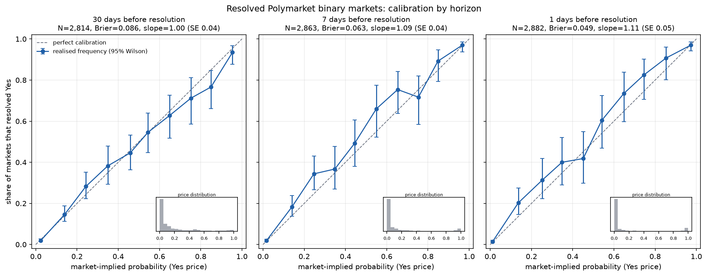
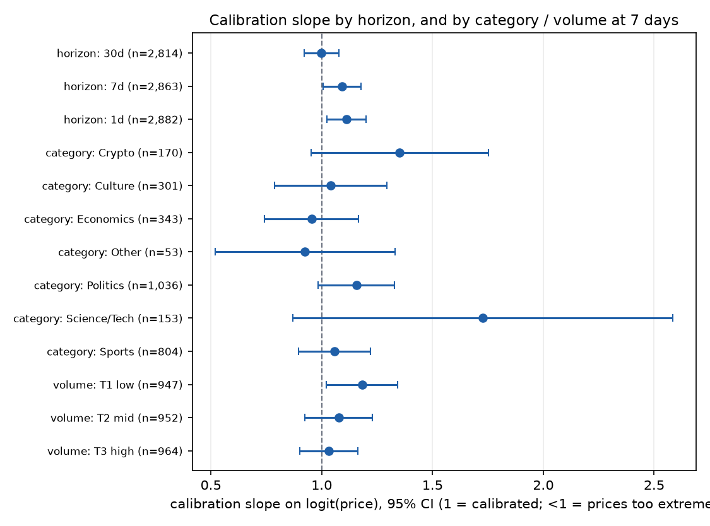
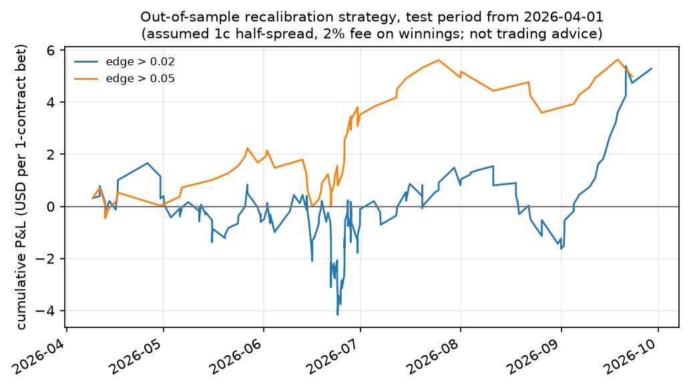

# honest-odds: are prediction markets calibrated?

[](https://github.com/CH4RL3I/honest-odds/actions/workflows/ci.yml)  

A calibration and mispricing study of resolved Polymarket binary markets.

**Question.** When a Polymarket contract trades at 20 cents, does the event happen about 20% of the time? Where and when do prices deviate from realised frequencies, is there a favourite-longshot bias, and could a simple recalibration rule have exploited it out of sample, after costs?

**Short answer.** Prices are close to calibrated. At 30 days before resolution the calibration slope is 0.999 (SE 0.040). At 7 and 1 days the slope is slightly above 1 (1.09 and 1.11, SE about 0.045), i.e. prices are a little too moderate, which is the opposite of a classic favourite-longshot pattern. A recalibration strategy fitted on earlier markets earned a positive point estimate out of sample, but every confidence interval after costs includes zero. This is a small effect in a modest sample, not a finding of exploitable mispricing.



## Data

- Sample: **2,946 markets** resolving 2023-03-22 to 2026-09-28 (8,559 market-horizon snapshots; about 2,800-2,900 markets per horizon), pulled 2026-09-29 from the public Gamma and CLOB APIs (no key).
- Funnel: 313,647 closed markets with lifetime volume of at least USD 20,000 were listed. 99,870 were binary Yes/No with a clean resolution. 18,734 of those were open at least 31 days (so that all three horizons are observable for the same cohort). A seeded random sample of 3,000 was drawn (seed 0); 52 had no price history, leaving 2,946.
- The committed `data/sample.parquet` (110 KB) is this full analysed dataset, so every number and figure here reproduces offline.
- Category mix at 7 days: Politics 1,036, Sports 804, Economics 343, Culture 301, Crypto 170, Science/Tech 153, Other 53. Base rate of Yes is 19.5%.

## Method

- **Filter.** Outcomes exactly `["Yes","No"]`; final Yes price within 0.01 of 0 or 1 (this drops 50/50 voids and unresolved legacy markets with `["0","0"]` prices); lifetime volume of at least USD 20,000; start-to-resolution of at least 31 days.
- **Resolution time** is the earlier of `endDate` and `closedTime`, a proxy for when the outcome became knowable.
- **Snapshot.** For horizon h in {30, 7, 1} days, the Yes price is the last CLOB history point at or before `t_res - h` (no lookahead; enforced by tests). Points more than 2 days stale are discarded. History is 12-hourly (`fidelity=720`): the API returns empty results for finer fidelity on long-lived markets. It is a last-traded/quoted snapshot, not a mid or a fillable price.
- **Calibration curves.** 10 equal-width bins, Wilson 95% intervals.
- **Scores.** Brier, log loss (prices clipped to [0.01, 0.99]), Murphy decomposition (reliability, resolution, uncertainty). With continuous prices the identity BS = REL - RES + UNC holds up to a small within-bin term, reported in code as `within_bin`.
- **Favourite-longshot test.** Logistic regression of outcome on logit(price). Slope 1 and intercept 0 mean calibration; slope below 1 means prices are too extreme (longshots overpriced), above 1 too moderate. Cluster-robust (by market) sandwich standard errors, Wald tests. Breakdown tables also give Holm-adjusted p-values.
- **Strategy.** Strict time split at the 60th percentile of resolution time (2026-04-01). The recalibration mapping is fitted only on markets that resolved before the split. Test bets require both snapshot and resolution at or after the split, so every training outcome was public at bet time; straddling markets are dropped. Buy Yes or No, whichever has higher model expected profit, if it exceeds a threshold. Assumed costs: entry at price plus 1 cent half-spread, 2% fee on winnings only. CIs are cluster bootstraps over markets. One contract per bet.

## Results

Full tables: [`docs/results.md`](docs/results.md).

| Horizon | N | Brier | Brier of base rate | Log loss | Slope (SE) | p (slope = 1) |
|---|---|---|---|---|---|---|
| 30 days | 2,814 | 0.0858 | 0.1570 | 0.275 | 0.999 (0.040) | 0.98 |
| 7 days | 2,863 | 0.0628 | 0.1571 | 0.207 | 1.091 (0.044) | 0.038 |
| 1 day | 2,882 | 0.0489 | 0.1561 | 0.164 | 1.112 (0.045) | 0.013 |

Reliability is tiny at every horizon (0.0004 to 0.0011) against resolution of 0.07 to 0.11: nearly all of the forecast skill is discrimination, and miscalibration is a rounding error in Brier terms.

**Favourite-longshot bias: not found; if anything the reverse in the 5-20% range.** Contracts priced below 5% resolve Yes at their price (7 days: priced 1.0%, realised 0.8%, CI 0.5-1.4%). Contracts priced 10-20% resolved Yes more often than priced: 18.2% vs 14.0% at 7 days (CI 13.7-23.8%), 20.3% vs 13.6% at 1 day (CI 14.6-27.5%). The 5-10% bucket shows the same direction (9.7% vs 7.0% at 7 days), but that interval (6.5-14.2%) is wide. Longshots were, if anything, slightly underpriced. Caution: three horizons are tested on overlapping markets, so they are not independent tests; the 1-day slope p-value of 0.013 clears a Bonferroni threshold of 0.017 only narrowly, and the 7-day p of 0.038 does not.



**Where is calibration worst?** Mostly nowhere that survives multiple-testing correction. At 30 days, Economics has a slope of 0.78 (SE 0.08; prices too extreme; Holm-adjusted p 0.050), the only segment near significance. The low-volume tercile at 7 days has slope 1.18 (SE 0.08) against 1.03 for the high-volume tercile, which fits thinner markets being less efficient, but the Holm-adjusted p is 0.079. Category estimates for Crypto, Science/Tech and Other have very wide intervals. One segment (Science/Tech, 1 day) is perfectly separable and reported blank.

**Naive strategy, out of sample** (test period 2026-04-01 onward, 1,117 test markets at 7 days; assumed 1c half-spread + 2% fee on winnings):

| Threshold on expected profit | Bets | Mean P&L per contract | 95% CI | Hit rate |
|---|---|---|---|---|
| 0.00 | 283 | +0.047 | -0.002 to +0.099 | 59% |
| 0.02 | 185 | +0.029 | -0.034 to +0.093 | 63% |
| 0.05 | 65 | +0.077 | -0.032 to +0.181 | 72% |
| 0.10 | 0 | n/a | n/a | n/a |
| 0.02, frictionless | 249 | +0.054 | +0.001 to +0.110 | 59% |

At 1 day: +0.030 (CI -0.020 to +0.081) at threshold 0, +0.015 (-0.045 to +0.079) at 0.02. Point estimates are positive, but with costs no interval excludes zero, and the equity curve is not smooth (a drawdown of about 4 contracts in June 2026, see below). The fitted mapping was consistent with the in-sample result (slope about 1.12), so the rule mostly bets on the mild underconfidence noted above. **This is not trading advice.** It ignores slippage, market impact, capacity, whether the snapshot price was actually fillable, and real fee schedules (the assumed 2% is a simplification; fees on Polymarket vary by market type and period). A positive but statistically indistinguishable result from one test window is what noise looks like.



## Limitations

- **Selection and survivorship.** Only closed markets with a clean Yes/No resolution, at least USD 20,000 volume and at least 31 days of life are included. Markets that were voided, never resolved cleanly, or were too small or short-lived are excluded. Results do not describe short-dated crypto or sports markets, which dominate the platform by count.
- **Resolution disputes and noise.** Outcomes are the platform's final prices; disputed or mis-resolved markets are treated as truth. Markets can also resolve early in substance (the event happened) before `closedTime`; `t_res = min(endDate, closedTime)` is a proxy, so the 1-day snapshot may sometimes already reflect the outcome.
- **Horizon snapshot.** The price is the last 12-hourly history point, not a mid or executable price, and may be up to 2 days stale in thin markets.
- **Thin markets.** Many contracts sit at 1-3 cents with little liquidity; about two thirds of snapshots are priced below 10%, so mid and high bins have 50-250 observations and wide intervals.
- **Dependence.** A market appears at up to three horizons; per-horizon tables use one row per market, and pooled regressions cluster by market. Markets within an event (for example several strikes of one price question) are correlated but are not clustered by event.
- **Multiple testing.** Dozens of segment comparisons are reported; Holm p-values are shown for the breakdown tables, and nothing beyond the 30-day slope test is robust to correction.
- **Sample.** A 3,000-market random sample of about 18,700 eligible markets, one time window, one platform. The strategy test covers about six months and depends on the choice of split date.
- **Category** is a coarse mapping of Gamma tags (see `pmcal.parse`); "Other" and "Science/Tech" are small.

## Reproduce

```bash
uv sync
uv run pytest -q                 # offline tests
uv run pmcal analyze             # uses data/sample.parquet; writes docs/*.png and docs/results.md
uv run pmcal fetch --sample 3000 # rebuild from the APIs (roughly an hour; caches in data/raw/)
```

`fetch` is throttled, retries with exponential backoff and caches every raw response under `data/raw/` (gitignored). Rerunning after the listing changes will produce a different sample.

## References

- Wolfers, J. and Zitzewitz, E. (2004). Prediction Markets. *Journal of Economic Perspectives* 18(2), 107-126.
- Thaler, R. H. and Ziemba, W. T. (1988). Anomalies: Parimutuel Betting Markets: Racetracks and Lotteries. *Journal of Economic Perspectives* 2(2), 161-174.
- Snowberg, E. and Wolfers, J. (2010). Explaining the Favorite-Long Shot Bias: Is it Risk-Love or Misperceptions? *Journal of Political Economy* 118(4), 723-746.
- Brier, G. W. (1950). Verification of Forecasts Expressed in Terms of Probability. *Monthly Weather Review* 78(1), 1-3.
- Murphy, A. H. (1973). A New Vector Partition of the Probability Score. *Journal of Applied Meteorology* 12(4), 595-600.
- Wilson, E. B. (1927). Probable Inference, the Law of Succession, and Statistical Inference. *Journal of the American Statistical Association* 22(158), 209-212.

## License

MIT, Emilio Gappa, 2026.
